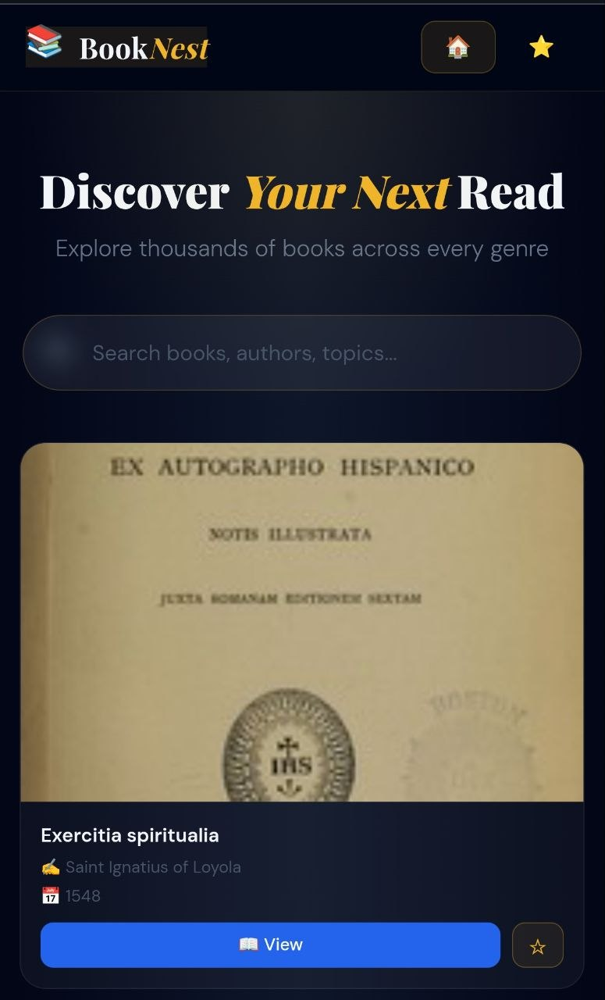

📚 BookNest - Amr Ibrahem

BookNest is a dynamic book exploration platform powered by an external API. It allows users to search, discover, and browse through a vast library of books with a seamless and modern interface.

---

## 🌐 Live Demo
You can explore the live site here: 
👉 [effortless-pegasus-c86822.netlify.app](https://booknest-eta.vercel.app/)

---

## 📸 Preview

---

## ✨ Features
* Live API Integration: Fetches real-time book data and details.
* Smart Search: Find any book quickly using the search functionality.
* Fully Responsive: Beautifully designed for Mobile, Tablet, and Desktop.
* Modern UI: A cozy and professional layout for book lovers.

---

## 🛠️ Tech Stack
* vue.js
* * api
* HTML5 (Structure)
* CSS3 (Styling & Responsive Layouts)
* JavaScript (ES6+) (API Fetching & Dynamic Rendering)
* REST API (Integrated for book data)
* Netlify (Hosting & Deployment)

---

## 🎯 Skills Demonstrated
* API Handling: Managing asynchronous requests and handling JSON data.
* Dynamic UI Updates: Updating the DOM instantly based on user search.
* Error Handling: Ensuring the app runs smoothly during data fetching.

---

## 📧 Connect With Me
Feel free to reach out for collaborations or just a friendly hello!

* LinkedIn: [Amr Ibrahem](https://www.linkedin.com/in/amr-ibrahem-44545131a?utm_source=share_via&utm_content=profile&utm_medium=member_android)
* Email: [amri69217@gmail.com](mailto:amri69217@gmail.com)
